**🧠🔬 Semantic Segmentation: Brain Tumor Detection 🩻**

---

### 🌐 Dataset

* **Source
  **: [KaggleHub Dataset - Brain Tumor Segmentation](https://www.kaggle.com/datasets/nikhilroxtomar/brain-tumor-segmentation)
* **Structure**:

    * Images: 2D grayscale images of brain scans.
    * Masks: Binary masks corresponding to tumor locations.

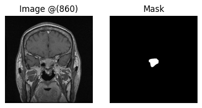
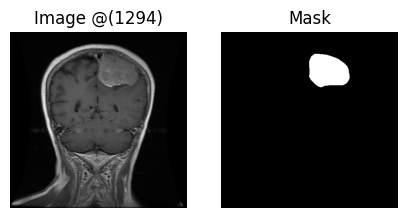
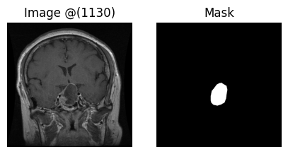

---

### ⚖️ Preprocessing Pipeline

1. **Image Loading**: Read grayscale images and masks using OpenCV.
2. **Resizing**: All images and masks resized to `224x224`.
3. **Filtering Channels**:

    * Canny edge detectors with multiple thresholds.
    * Directional gradients using Sobel + angle computation.
4. **Normalization**:

    * Input range scaled to `[-1, 1]`.
    * Masks binarized to `-1` (background) and `1` (tumor).
5. **Channel Stacking**:

    * Input: Original + 3 edge-based channels (total 4).
    * Output: Single binary mask.

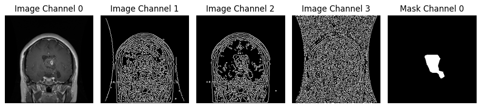

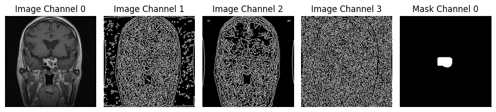

---

### 🔧 Augmentation

* Applied on-the-fly using NumPy-based custom logic:

    * Horizontal flip
    * Random rotation (± 10 degrees)
    * Random crop and resize
    * Brightness/contrast shift
    * Gaussian noise

---

### 📊 Data Split

* Train / Validation / Test split using `train_test_split`
* Controlled with seed: `42`

---

### ⚖️ Data Generator

* `MyDataGenerator`:

    * Efficient I/O using `ThreadPoolExecutor`
    * Caching mechanism for repeated loading
    * On-the-fly augmentation

---

### 📊 Loss & Metrics

* **Loss**: Dice Loss (custom)
* **Metrics**:

    * Dice Coefficient
    * Intersection over Union (IoU)

---

### 🧱 Model Architectures

* **Shared components**:

    * Encoder-decoder structure (U-Net based)
    * Squeeze-and-Excitation blocks
    * Skip connections

#### 📈 Model 1: `unet_v1`

* UpSampling-based decoder
* Uses `SE blocks` in bottleneck only


#### 📈 Model 2: `unet_v2`

* Conv2DTranspose-based decoder
* `SE blocks` used in decoder as well


---

### 🌟 Training

* Optimizer: Adam
* Epochs: 70
* Callbacks:

    * EarlyStopping (patience=5)
    * ModelCheckpoint (best weights)
    * ReduceLROnPlateau
    * HistoryCheckpoint (custom logger)

---

### 🎯 Evaluation

* Quantitative:

    * Trained models evaluated on test set
    * Metrics printed: Dice, IoU, Loss
* Qualitative:

    * Plots showing:

        * Input
        * Ground truth mask
        * Predicted mask
        * Differences
        * Overlays (image + mask / prediction)

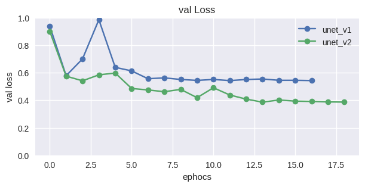
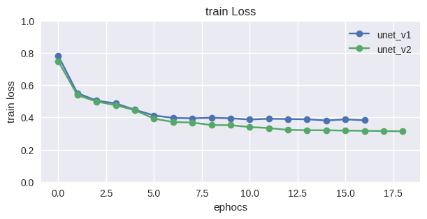
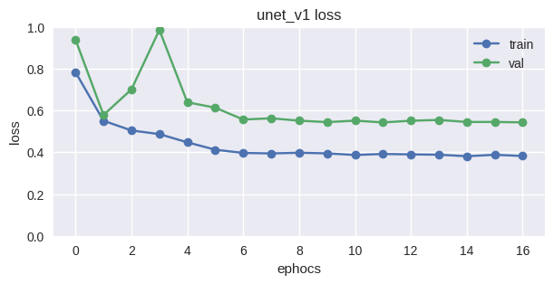
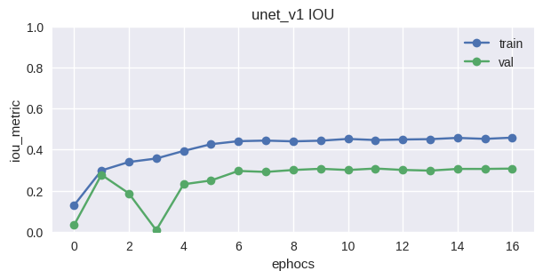
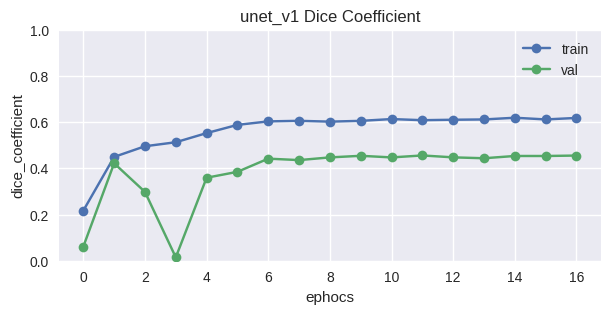
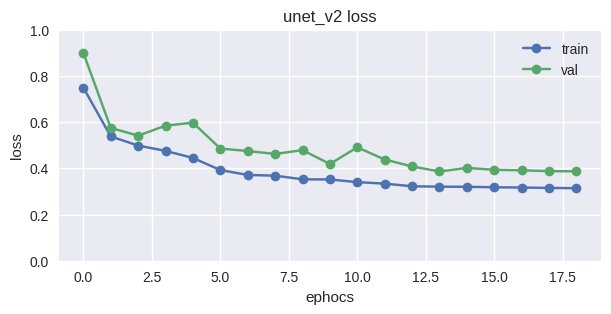
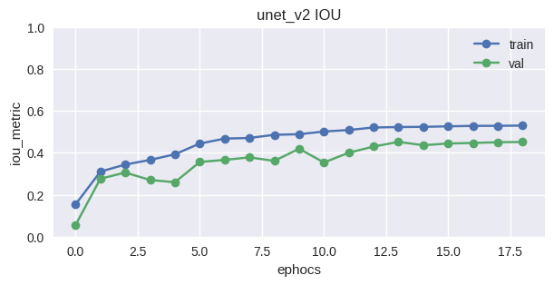
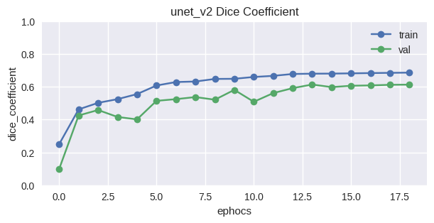

---

### 📷 Visuals

* Random raw samples (image + mask)
* Augmented sample comparisons
* Preprocessed stacked channels
* Training/validation curves

    * Loss
    * Dice
    * IoU
* Model predictions: train / val / test

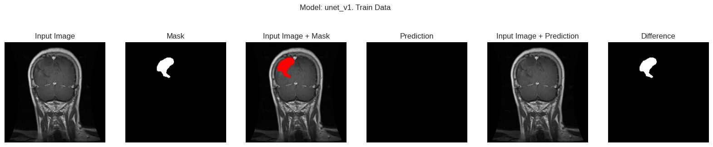
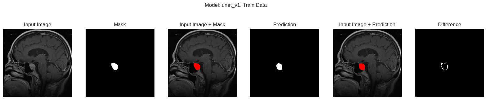
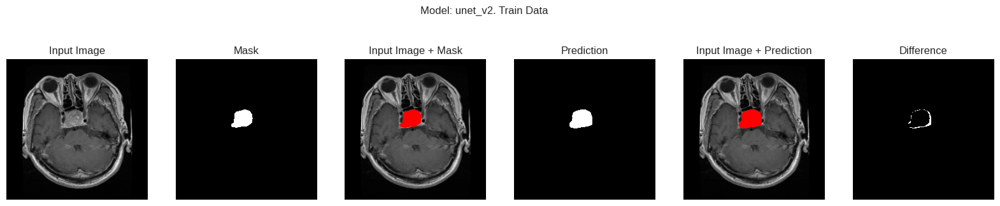
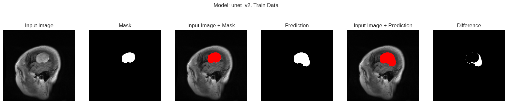
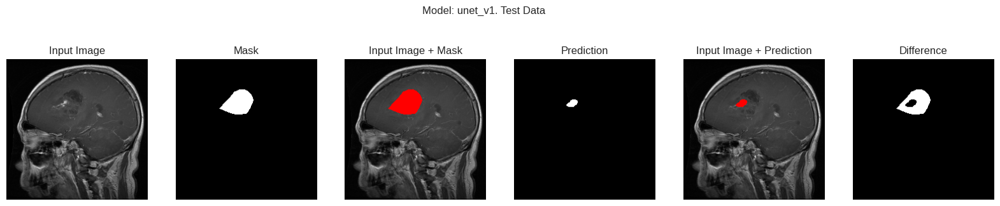
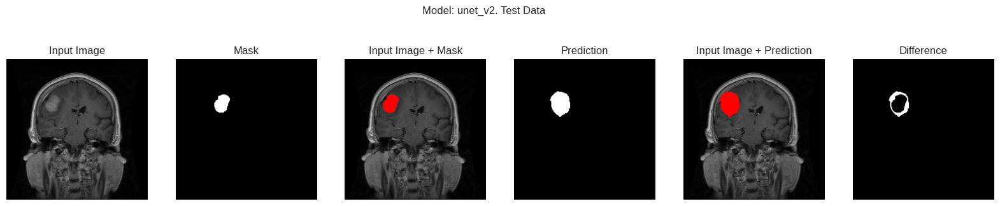


---

### 🎓 Notes

* Dataset normalization plays key role in training stability.
* Custom augmentations designed specifically for medical imagery.
* SE blocks improve learning of semantic context.
* Canny filters and direction-based channels boost edge-based understanding.

---

### 📦 Folder Structure Suggestion

```
.
├── models_cache/
│   ├── *.weights.h5
│   ├── *.history.json
│   └── *_arch.png
├── drive/MyDrive/brain_tumor_outputs/
├── plots/
├── results/
├── notebook.ipynb
└── README.md
```

---
